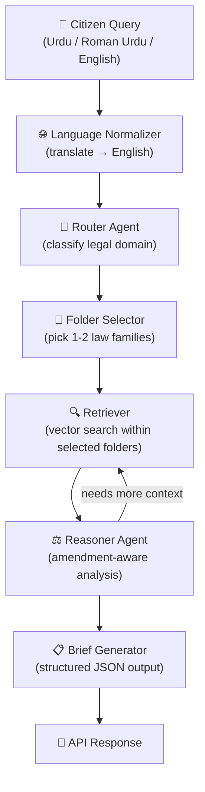
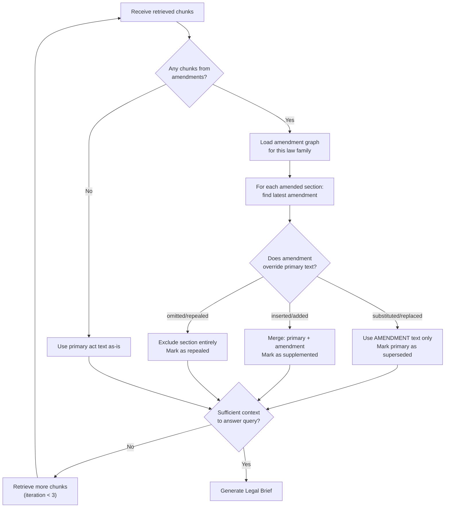

# Agent 1: Legal Analyst Agent — Implementation Plan

## 1. Executive Summary

Build an **Agentic RAG (Retrieval-Augmented Generation)** pipeline that receives citizen legal problems in **Urdu, Roman Urdu, or English**, reasons over Pakistani family-law PDFs, and returns a structured **Legal Brief** containing Problem Classification, Relevant Statutes, and Impact Analysis — all grounded in the provided statutory data.

---

## 2. Data Analysis — Wakeel-AI-data

### 2.1 Corpus Inventory

| # | Folder | PDFs | Primary Law | Amendments |
|---|--------|------|-------------|------------|
| 1 | Dowry and Bridal Gifts Act 1976 | 2 | `XLIII. The Dowry and Bridal Gifts (Restriction) Act, 1976.pdf` | `XXXVI. …(Amendment) Ordinance, 1980.pdf` |
| 2 | The Child Marriage Restraint Act | 3 | `XIX-THe Child Marriage Restraint Act, 1929.pdf` | `VII. …(Amendment) Act, 1938.pdf`, `XIX. …(Second Amendment) Act, 1938.pdf` |
| 3 | Dissolution of Muslim Marriages Act, 1939 | 1 | `VIII- …1939 OCR (1).pdf` | *(none)* |
| 4 | The Muslim Family Laws Ordinance | 5 | `VIII The Muslim Family Laws Ordinance, 1961.pdf` | `XXI …(Amendment) 1961`, `XXVIII …(Amendment) 2021`, `XXIX …(Second Amendment) 2021`, `XXX …(Second Amendment) 1961` |
| 5 | The Protection of Parents Ordinance | 1 | `…Ordinance, 2021 (1).pdf` | *(none)* |
| 6 | The West Pakistan Family Courts Act | 6 | `XXXV The West Pakistan Family Courts Act 1964.pdf` | `XXI …1994`, `X …1996`, `VII …1997`, `I …1997`, `LV …2002` |

**Totals:** 6 law families · 18 PDF files · ~33 MB

### 2.2 Key Structural Observations

1. **Folder = Law Family.** Each subfolder groups a primary statute with its amendments — this is the natural routing unit.
2. **Roman-numeral prefixes** encode gazette sequence, not chronological order. The parser must extract the **year** from the filename/content for temporal ordering.
3. **Amendment linkage** is implicit: amendments sit in the same folder as their parent act. There is no explicit metadata file. The ingestion pipeline must build a `primary → [amendments…]` graph from parsed titles.
4. **OCR quality varies.** The Dissolution Act PDF filename contains "OCR", signalling it is a scanned image. Other large files (Family Courts Act at 11 MB) likely contain scanned pages too. The parser must handle both native-text and OCR PDFs.
5. **Domain is narrow:** All 18 PDFs fall under **Pakistani Family Law**. This constrains the vector space and makes retrieval highly effective with a small, focused index.

---

## 3. Agentic RAG Architecture

### 3.1 High-Level Pipeline



### 3.2 Component Breakdown

#### 3.2.1 Language Normalizer
- **Purpose:** Convert any input (Urdu script, Roman Urdu, English) into a canonical English query for downstream processing.
- **Approach:** Use the LLM itself with a system prompt: *"Translate the following citizen legal query into clear English. Preserve all legal specifics (names, amounts, relationships)."*
- **Fallback:** If the input is already English, pass through unchanged.

#### 3.2.2 Router Agent (Domain Classifier)
- **Purpose:** Narrow the search space *before* retrieval — this is what makes it "Agentic" rather than naive RAG.
- **Input:** Normalized English query.
- **Output:** One or more `law_family_id` tags from a fixed enum:

```python
class LawFamily(str, Enum):
    DOWRY_ACT = "dowry_and_bridal_gifts"
    CHILD_MARRIAGE = "child_marriage_restraint"
    DISSOLUTION = "dissolution_muslim_marriages"
    MUSLIM_FAMILY_LAWS = "muslim_family_laws"
    PARENT_PROTECTION = "protection_of_parents"
    FAMILY_COURTS = "family_courts"
```

- **Method:** LLM function-calling with the enum as the tool schema. The model picks the 1–2 most relevant families based on the query.

#### 3.2.3 Retriever (Scoped Vector Search)
- **Vector Store:** ChromaDB (local, file-based — no infra dependency).
- **Embedding Model:** `sentence-transformers/all-MiniLM-L6-v2` (fast, 384-dim, good for English legal text).
- **Scoping:** Each chunk is tagged with `law_family` and `document_type` (primary | amendment) metadata. The retriever filters by the Router's selected families before similarity search.
- **Chunk Strategy:** Section-based splitting (see §4.1) with 800-token chunks, 200-token overlap.
- **Top-K:** Retrieve top 8 chunks, then re-rank using the LLM.

#### 3.2.4 Reasoner Agent (Amendment-Aware Analysis)
- **Core Logic:** Given retrieved chunks, determine:
  1. Is any retrieved section from an **amendment** that **overrides** a primary law section?
  2. Are any retrieved sections **contradictory**?
  3. Is there **sufficient context** to answer, or should we retrieve more?
- **Implementation:** An LLM call with a structured prompt and tool-use for `retrieve_more(query, law_family)`.
- **Loop Limit:** Max 3 retrieval iterations to prevent runaway costs.

#### 3.2.5 Brief Generator
- **Output Schema:**

```json
{
  "problem_classification": {
    "category": "Dowry Dispute",
    "sub_category": "Excessive Dowry Demand",
    "severity": "high",
    "jurisdiction": "Family Court"
  },
  "relevant_statutes": [
    {
      "law_name": "The Dowry and Bridal Gifts (Restriction) Act, 1976",
      "section": "Section 3",
      "text_excerpt": "...",
      "is_amended": true,
      "amended_by": "Ordinance XXXVI of 1980",
      "current_status": "Active (as amended)"
    }
  ],
  "impact_analysis": {
    "citizen_rights": "...",
    "potential_penalties": "...",
    "recommended_actions": ["..."],
    "time_limitations": "..."
  },
  "confidence_score": 0.87,
  "sources_used": ["..."]
}
```

---

## 4. Skill Definitions

### 4.1 Skill: `pdf-parser`
| Attribute | Detail |
|-----------|--------|
| **Purpose** | Extract structured text from all 18 PDFs, handling both native-text and OCR-scanned documents |
| **Input** | Path to a PDF file |
| **Output** | List of `Section` objects: `{section_number, title, body, page_range}` |
| **Key Logic** | 1. Detect if PDF is native-text or scanned (heuristic: char count per page). 2. For native-text: use `pymupdf` (fitz). 3. For scanned: use `unstructured.io` with Tesseract OCR backend. 4. Parse section boundaries using regex for Pakistani legislative patterns (`Section \d+`, `Article \d+`, numbered clauses). |
| **Libraries** | `pymupdf`, `unstructured[pdf]`, `pytesseract` |

### 4.2 Skill: `amendment-linker`
| Attribute | Detail |
|-----------|--------|
| **Purpose** | Build a temporal graph linking amendments to their parent acts |
| **Input** | Parsed sections from all PDFs in a law family folder |
| **Output** | `AmendmentGraph`: `{primary_act, amendments: [{year, ordinance_number, sections_modified: [...]}]}` |
| **Key Logic** | 1. Identify the primary act (no "Amendment" in title). 2. Parse amendment preambles for "shall be substituted/inserted/omitted" patterns. 3. Map each amendment section to the primary act section it modifies. 4. Sort amendments chronologically to determine the **current effective text**. |

### 4.3 Skill: `law-matcher`
| Attribute | Detail |
|-----------|--------|
| **Purpose** | Route a normalized query to the correct law family and retrieve relevant chunks |
| **Input** | English query string |
| **Output** | Ranked list of `{chunk_text, law_family, document_type, section_ref, relevance_score}` |
| **Key Logic** | 1. Call Router Agent to classify. 2. Query ChromaDB with metadata filter. 3. Re-rank results using cross-encoder or LLM scoring. |
| **Libraries** | `chromadb`, `sentence-transformers`, `langchain-core` |

### 4.4 Skill: `brief-generator`
| Attribute | Detail |
|-----------|--------|
| **Purpose** | Synthesize retrieved legal context into a structured Legal Brief |
| **Input** | Query + ranked chunks + amendment graph |
| **Output** | Structured JSON Legal Brief (schema in §3.2.5) |
| **Key Logic** | 1. Feed chunks + amendment graph to the Reasoner Agent. 2. Execute reasoning loop (max 3 iterations). 3. Generate final brief with confidence score. 4. Validate output against JSON schema before returning. |
| **Libraries** | `langchain-core`, `pydantic` (for output validation) |

---

## 5. Reasoning Loop — Amendment Conflict Resolution



### 5.1 Conflict Resolution Rules

1. **Later-in-time prevails:** If Section 5 of the 1976 Act is modified by the 1980 Amendment, the 1980 text is authoritative.
2. **Substitution = full override:** "shall be substituted" means the old text is dead.
3. **Insertion = additive:** "shall be inserted after" means both texts coexist.
4. **Omission = deletion:** "shall be omitted" means the section no longer exists.
5. **Provincial vs. Federal:** Flag if a law has provincial variations (e.g., West Pakistan acts may have been adopted differently post-1970).

---

## 6. Tool & Library Selection

### 6.1 Core Stack

| Category | Library | Version | Rationale |
|----------|---------|---------|-----------|
| **PDF Parsing (native)** | `pymupdf` (PyMuPDF) | 1.25.x | Fastest pure-Python PDF text extractor; handles tables well |
| **PDF Parsing (scanned)** | `unstructured[pdf]` | 0.16.x | Best-in-class for OCR-heavy, table-rich legal PDFs; uses Tesseract under the hood |
| **OCR Engine** | `pytesseract` + Tesseract | 5.x | Required by `unstructured` for scanned PDFs |
| **Vector Store** | `chromadb` | 0.6.x | Local, file-based, zero-infra; perfect for MVP |
| **Embeddings** | `sentence-transformers` | 3.x | `all-MiniLM-L6-v2` — fast, lightweight, good quality |
| **LLM Orchestration** | `langchain-core` | 0.3.x | Minimal footprint; only the core abstractions (no bloated langchain) |
| **LLM Provider** | `langchain-google-genai` | 2.x | Google Gemini API — strong multilingual + function-calling |
| **Output Validation** | `pydantic` | 2.x | Already in the project; used for Legal Brief schema enforcement |
| **Text Chunking** | `langchain-text-splitters` | 0.3.x | `RecursiveCharacterTextSplitter` with legal-aware separators |
| **API Framework** | `fastapi` | existing | Already the project backbone |

### 6.2 Why These Choices?

- **`unstructured.io` over raw Tesseract:** The Pakistani gazette PDFs contain complex multi-column layouts, tables of amendments, and marginal notes. `unstructured` handles layout analysis before OCR, producing far cleaner text.
- **ChromaDB over Pinecone/Weaviate:** The corpus is small (18 PDFs, ~33 MB). A local vector store avoids API costs and latency. Easy to migrate later.
- **LangChain-core (not full LangChain):** We only need the `Runnable` interface and message types. Avoids dependency bloat.
- **Gemini over OpenAI:** Superior Urdu/multilingual understanding, generous free tier, strong function-calling for the Router Agent.

---

## 7. Proposed Changes to Codebase

### Data Ingestion Pipeline

#### [NEW] `app/agent/ingest/pdf_parser.py`
- Parse all 18 PDFs using `pymupdf` + `unstructured` fallback
- Extract sections, titles, and body text
- Output: list of `ParsedSection` pydantic models

#### [NEW] `app/agent/ingest/amendment_linker.py`
- Build the `primary → amendments` graph per law family
- Parse "substituted/inserted/omitted" patterns
- Output: `AmendmentGraph` per law family

#### [NEW] `app/agent/ingest/vectorizer.py`
- Chunk parsed sections (800 tokens, 200 overlap)
- Embed with `all-MiniLM-L6-v2`
- Store in ChromaDB with metadata: `law_family`, `doc_type`, `section_ref`, `year`

#### [NEW] `app/agent/ingest/run_ingest.py`
- CLI script to run full ingestion pipeline
- Idempotent: clears and rebuilds the vector store

---

### Agent Core

#### [NEW] `app/agent/core/schemas.py`
- Pydantic models: `LegalBrief`, `ProblemClassification`, `StatuteReference`, `ImpactAnalysis`, `LawFamily` enum

#### [NEW] `app/agent/core/normalizer.py`
- Language detection + translation to English via LLM

#### [NEW] `app/agent/core/router.py`
- Router Agent: classifies query → `LawFamily` enum using LLM function-calling

#### [NEW] `app/agent/core/retriever.py`
- Scoped vector search with ChromaDB + metadata filtering

#### [NEW] `app/agent/core/reasoner.py`
- Amendment-aware reasoning loop (max 3 iterations)
- Conflict resolution logic from §5

#### [NEW] `app/agent/core/brief_generator.py`
- Orchestrates the full pipeline: normalize → route → retrieve → reason → generate brief

---

### API Layer

#### [NEW] `app/api/v1/legal_analyst.py`
- `POST /api/v1/legal/analyze` — accepts query, returns Legal Brief
- Protected with existing JWT auth dependency

#### [MODIFY] [main.py](file:///d:/wakeel-ai-be/app/main.py)
- Register the new `legal_analyst` router

#### [MODIFY] [config.py](file:///d:/wakeel-ai-be/app/config.py)
- Add settings: `GEMINI_API_KEY`, `CHROMA_PERSIST_DIR`, `DATA_PATH`

---

### New Dependencies

#### [MODIFY] [requirements.txt](file:///d:/wakeel-ai-be/requirements.txt)
- Add: `pymupdf`, `unstructured[pdf]`, `pytesseract`, `chromadb`, `sentence-transformers`, `langchain-core`, `langchain-text-splitters`, `langchain-google-genai`

---

## 8. Directory Structure (New Files)

```
app/
├── agent/
│   ├── __init__.py
│   ├── ingest/
│   │   ├── __init__.py
│   │   ├── pdf_parser.py          # Skill: pdf-parser
│   │   ├── amendment_linker.py    # Skill: amendment-linker
│   │   ├── vectorizer.py          # Chunking + embedding + ChromaDB
│   │   └── run_ingest.py          # CLI: python -m app.agent.ingest.run_ingest
│   └── core/
│       ├── __init__.py
│       ├── schemas.py             # Pydantic output models
│       ├── normalizer.py          # Language normalization
│       ├── router.py              # Router Agent (domain classifier)
│       ├── retriever.py           # Scoped vector retrieval
│       ├── reasoner.py            # Amendment-aware reasoning loop
│       └── brief_generator.py     # Orchestrator → Legal Brief
├── api/
│   └── v1/
│       └── legal_analyst.py       # POST /api/v1/legal/analyze
```

---

## 9. Verification Plan

### Automated Tests

1. **PDF Parser Test:** Parse each of the 18 PDFs and assert `len(sections) > 0` for each.
2. **Amendment Linker Test:** For "Muslim Family Laws Ordinance" folder (5 PDFs), assert the graph has 1 primary + 4 amendments with correct year ordering.
3. **Router Test:** Feed 10 sample queries and assert correct `LawFamily` classification.
4. **Retriever Test:** For query "can husband demand dowry back", assert top chunks come from `dowry_and_bridal_gifts` family.
5. **Reasoning Loop Test:** Feed a query about a section that was amended; assert the response uses the amendment text, not the superseded primary text.
6. **End-to-End Test:** Send a full Urdu query to `/api/v1/legal/analyze` and validate the response matches the `LegalBrief` JSON schema.

### Manual Verification

1. **Legal Accuracy Review:** Compare 5 generated briefs against manually researched answers for known family law scenarios.
2. **Urdu Input Test:** Test with real Urdu script and Roman Urdu queries from the mobile app.
3. **Hallucination Check:** Ask about a law NOT in the corpus (e.g., criminal law); verify the agent returns a "not in scope" response rather than hallucinating.

---

## 10. Anti-Hallucination Safeguards

| Safeguard | Implementation |
|-----------|---------------|
| **Grounding enforcement** | Every statute citation in the brief MUST include `text_excerpt` copied verbatim from a retrieved chunk |
| **Confidence scoring** | If retrieval similarity score < 0.6 for all chunks, return `confidence_score < 0.5` and flag as "low confidence" |
| **Scope guard** | If Router Agent cannot map query to any `LawFamily`, return a structured "out of scope" response |
| **Source attribution** | Every claim in the brief links back to `{pdf_filename, page_number, section}` |
| **Amendment awareness** | Never cite a superseded section without noting it has been amended |

---

## 11. Phased Delivery Roadmap

| Phase | Scope | Deliverable |
|-------|-------|-------------|
| **Phase 1** | PDF Ingestion | `pdf_parser.py`, `amendment_linker.py`, `vectorizer.py`, `run_ingest.py` — all 18 PDFs parsed and indexed |
| **Phase 2** | Agent Core | `normalizer.py`, `router.py`, `retriever.py`, `reasoner.py`, `brief_generator.py` — working pipeline in isolation |
| **Phase 3** | API Integration | `legal_analyst.py` router, config updates, end-to-end testing via `/api/v1/legal/analyze` |
| **Phase 4** | Hardening | Anti-hallucination safeguards, confidence scoring, Urdu/Roman Urdu edge cases, error handling |

---

## Open Questions

> [!IMPORTANT]
> **LLM Provider:** The plan assumes Google Gemini. Do you have a Gemini API key, or would you prefer OpenAI / a local model (e.g., Ollama)?

> [!IMPORTANT]
> **Scope Expansion:** The current corpus covers only **Family Law** (6 acts). Are more PDF folders coming? This affects the Router Agent's enum and the vector store partitioning strategy.

> [!WARNING]
> **OCR Quality:** The Dissolution Act PDF is flagged as OCR. I recommend running a test parse on it first to assess text quality before building the full pipeline. Should we prioritize an OCR quality audit as Phase 0?

> [!NOTE]
> **Response Language:** Should the Legal Brief be returned in English only, or should the `brief_generator` also produce an Urdu translation of the output for the mobile UI?
